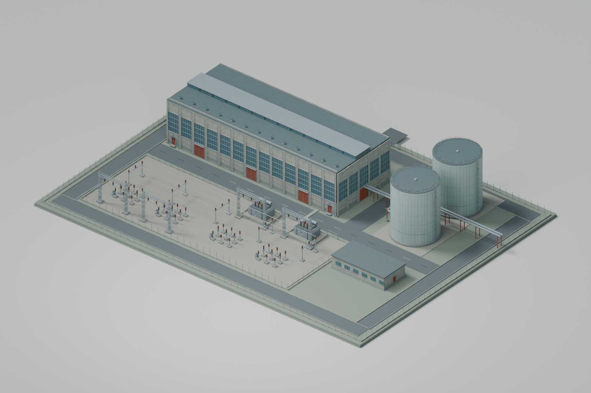

# Phobos' W&R Building Works

Original building mods for **Workers & Resources: Soviet Republic**, supported by a
shared library of reusable architectural and industrial parts.

**Status: P02 placed and completed; progressive construction still fails. Small probe test pending.**
Concept A has editable Blender sources, reusable components and review renders.
P01 is archived for rollback; P02 is the active local prototype. Heat delivery and
performance remain unverified. There are no Workshop uploads or supported releases.
The first project is **Phobos'
Electric Heating Works**: a large electric district-heating complex with a substantial
receiving switchyard.

[Review Concept A in 3D](mods/electric-heating-works/design/prototype-a01/README.md)

[A02: actual reused props and original site details](mods/electric-heating-works/design/detail-a02/README.md)
records the vanilla fence panels, lamps and barriers used in the local assembly.
The mixed scene and its renders stay outside GitHub; the public image below contains
only original A04 art, including boundary supports without external infill or lamps.

[A03: original textured components and native inspection handoff](mods/electric-heating-works/design/material-a03/README.md)
now includes public Blender, PNG, DDS, NMF and material sources. The first native
inspection confirms corrected material loading. The author now prefers the tuned
brightness baseline and the tuned A/B sample comparison is reviewed. Surface B is
the working choice; the native normal convention remains unverified.

[A04: complete plant, shared kit and native inspection handoff](mods/electric-heating-works/design/assembly-a04/README.md)
extends the approach across the hall, switchyard, tanks and service structures.
Saved-scene, texture and native geometry checks pass. The author accepted the tuned
surfaces and A05's 3 cm ground correction, then confirmed P01 placement. These
observations do not establish construction progression or operating capacity.

[P02: construction probe, four heat outlets and distance models](mods/electric-heating-works/gameplay/p02/README.md)
keeps P01 and A03–A05 intact and records the next manual acceptance steps.



## Start here

- [Illustrated design proposal: three site concepts](mods/electric-heating-works/design/README.md)
- [Implementation route and tools](docs/implementation-plan.md)
- [Electric Heating Works brief](mods/electric-heating-works/README.md)
- [Switchyard and power research](mods/electric-heating-works/switchyard.md)
- [Shared parts library](shared/README.md)
- [Reusable 3D modelling guide: buildings and vehicles](docs/3d-modelling-guide.md)
- [Measured model comparisons and construction recommendations](research/2026-09-12-model-budgets-and-construction.md)
- [P02 construction failure: robs074, wildbunny and Billman007 follow-up](research/2026-09-12-construction-followup.md)
- [Architecture and packaging](docs/architecture.md)
- [Research findings](research/2026-09-11-building-pipeline.md)
- [Where repeated objects come from: game and Workshop parts](research/2026-09-11-reusable-game-and-workshop-parts.md)
- [Installed-mod licence audit and author credits](research/2026-09-11-installed-mod-license-audit.md)
- [Electricity/heat findings and future test protocol](research/2026-09-11-electricity-and-heat.md)
- [Roadmap](docs/roadmap.md)
- [Licensing and provenance](docs/licensing-and-provenance.md)
- [Contributing](CONTRIBUTING.md)

## Repository layout

```text
mods/       Individual building projects: briefs, manifests and later their sources
shared/     Original reusable parts, materials and their catalogue
research/   Source-backed findings with explicit verification boundaries
docs/       Decisions, release planning and project conventions
scripts/    Repository checks and original design drawing tooling
```

Shared parts are reused **at build time**. Each future building mod is intended to
ship the assets it needs, so a source-library update will not silently change a
player's installed building. No shared Workshop runtime dependency is planned.

## Foundation and licence

The repository adapts the MIT licensing, community-maintenance, provenance and
contribution conventions of [Republic Observatory](https://github.com/phobos-dthorga/soviet-republic-observatory).
It is a separate project, with no Observatory, TesmioLoader or game-runtime dependency.

Original first-party contributions are MIT licensed unless explicitly marked
otherwise. Third-party rights remain with their respective owners. See [LICENSE](LICENSE)
and [NOTICE](NOTICE). Forks and independently maintained releases are welcome.

Independent community project; not affiliated with or endorsed by 3Division or
Hooded Horse. W&R and its assets belong to their respective owners.

Run repository checks with `python scripts/check_repository.py`.
