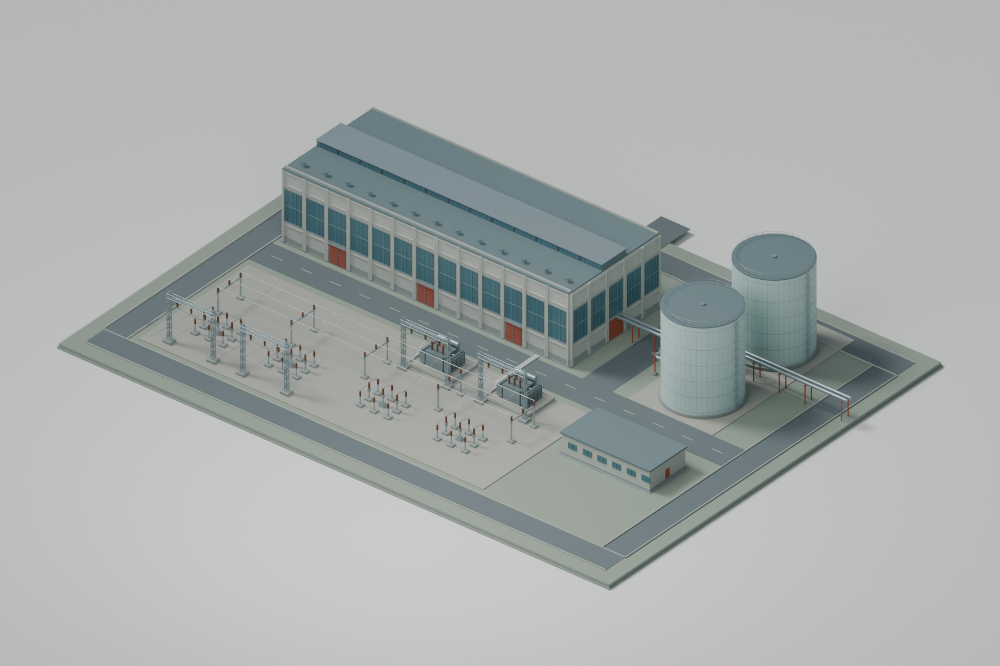

# Phobos' W&R Building Works

Original building mods for **Workers & Resources: Soviet Republic**, supported by a
shared library of reusable architectural and industrial parts.

**Status: first 3D visual prototype.** Concept A now has an editable Blender scene,
a reusable original component library and three review renders. There are no playable
mods, Workshop uploads or supported game releases yet. The first project is **Phobos'
Electric Heating Works**: a large electric district-heating complex with a substantial
receiving switchyard.

[Review Concept A in 3D](mods/electric-heating-works/design/prototype-a01/README.md)



## Start here

- [Illustrated design proposal: three site concepts](mods/electric-heating-works/design/README.md)
- [Implementation route and tools](docs/implementation-plan.md)
- [Electric Heating Works brief](mods/electric-heating-works/README.md)
- [Switchyard and power research](mods/electric-heating-works/switchyard.md)
- [Shared parts library](shared/README.md)
- [Architecture and packaging](docs/architecture.md)
- [Research findings](research/2026-09-11-building-pipeline.md)
- [Where repeated objects come from: game and Workshop parts](research/2026-09-11-reusable-game-and-workshop-parts.md)
- [Installed-mod licence audit and author credits](research/2026-09-11-installed-mod-license-audit.md)
- [Electricity/heat findings and future test protocol](research/2026-09-11-electricity-and-heat.md)
- [Roadmap](docs/roadmap.md)
- [Licensing and provenance](docs/licensing-and-provenance.md)
- [Contributing](CONTRIBUTING.md)

## Repository layout

```text
mods/       Individual building projects: briefs, manifests and later their sources
shared/     Original reusable parts, materials and their catalogue
research/   Source-backed findings with explicit verification boundaries
docs/       Decisions, release planning and project conventions
scripts/    Repository checks and original design drawing tooling
```

Shared parts are reused **at build time**. Each future building mod is intended to
ship the assets it needs, so a source-library update will not silently change a
player's installed building. No shared Workshop runtime dependency is planned.

## Foundation and licence

The repository adapts the MIT licensing, community-maintenance, provenance and
contribution conventions of [Republic Observatory](https://github.com/phobos-dthorga/soviet-republic-observatory).
It is a separate project, with no Observatory, TesmioLoader or game-runtime dependency.

Original first-party contributions are MIT licensed unless explicitly marked
otherwise. Third-party rights remain with their respective owners. See [LICENSE](LICENSE)
and [NOTICE](NOTICE). Forks and independently maintained releases are welcome.

Independent community project; not affiliated with or endorsed by 3Division or
Hooded Horse. W&R and its assets belong to their respective owners.

Run repository checks with `python scripts/check_repository.py`.
