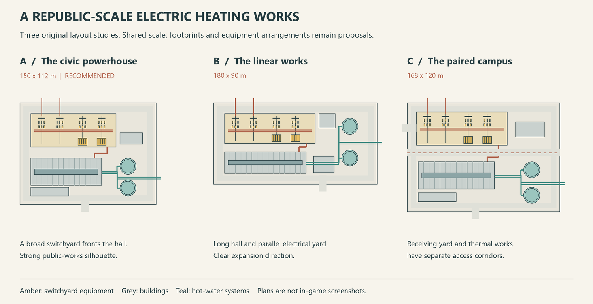
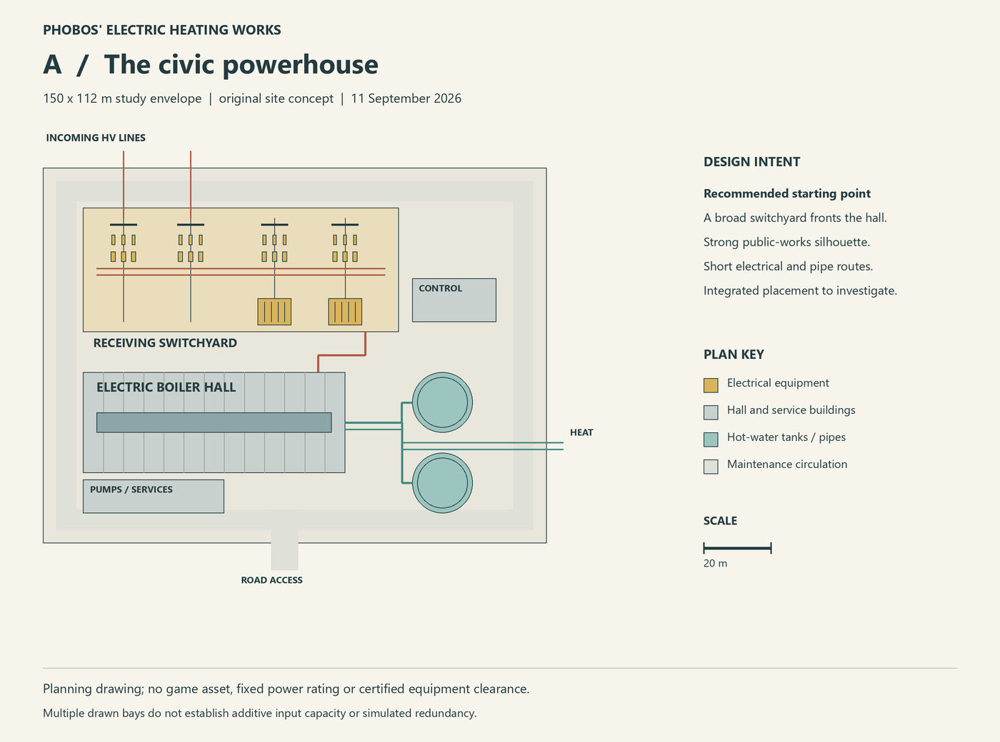
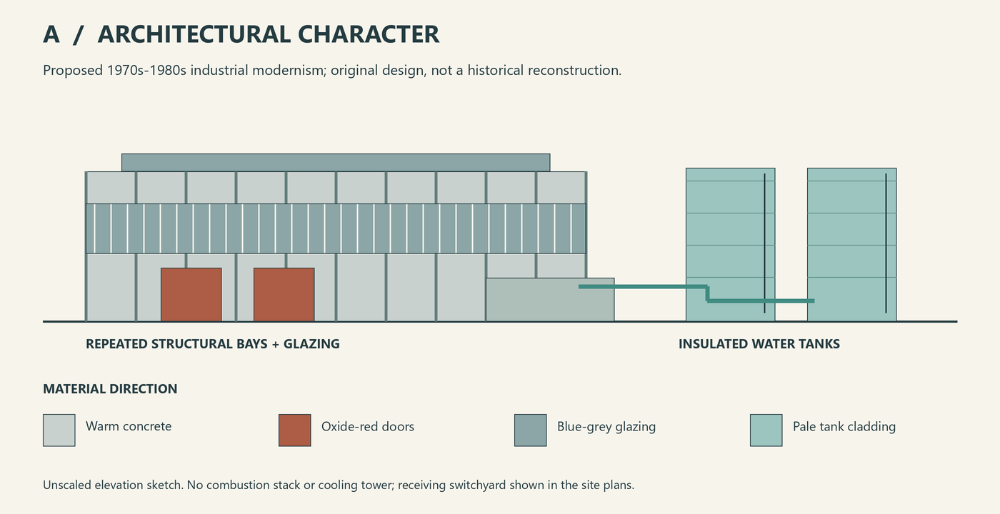

# Electric Heating Works — design proposal 01

11 September 2026. Original planning illustrations; **no game models or in-game
screenshots**. On 11 September 2026 the author identified Concept A as the most
promising direction. A is now the preferred layout for further development.
The footprints are study envelopes rather than approved building dimensions.

## Recommendation: A — The civic powerhouse

A 150 × 112 m compound gives the receiving switchyard a strong presence ahead of a
78 × 30 m boiler hall. Two 18 m diameter tank envelopes create a distinctive rear
silhouette. A low pump/service annex, separate relay house and perimeter service
route make the spaces between the main structures purposeful. The drawing reserves
two receiving positions and two transformer positions, without asserting native
connection count or redundancy.

The proposed architectural language is 1970s–1980s industrial modernism: repeated
concrete bays, long bands of blue-grey glazing, restrained oxide-red doors, exposed
steel supports and pale tank cladding. This is an original artistic direction, not
a reconstruction or a claim that a particular historical plant used these boilers.
Modern equipment references inform the process; period styling needs separate care.

## Alternatives and trade-offs

| Concept | Study envelope | Advantage | Main compromise |
|---|---|---|---|
| **A — civic powerhouse** | 150 × 112 m, 1.68 ha | Strong combined silhouette, clear receiving yard, relatively short routes | Broad site; single-building native feasibility unresolved |
| **B — linear works** | 180 × 90 m, 1.62 ha | Suits an industrial corridor; repeated hall bays suggest expansion | Long frontage and longer tank connections |
| **C — paired campus** | 168 × 120 m, about 2.02 ha | Yard and thermal works can be developed as separate placement zones | More land and connection coordination; separation alone adds no power capacity |

[Full B plan](concept-b.png) · [Full C plan](concept-c.png)

All three are original arrangements. There is no reuse of a building already used
by Phobos mods, or of a donor's geometry or textures. C is a layout contingency:
a separate transformer can still bottleneck delivery to a single consumer. Multiple
independent consuming buildings would be a different, larger scope decision.

## Architectural and process character

For A, start with a hall height study around 16–20 m and tanks around 20–24 m; these
are visual envelopes to refine, not calculated equipment requirements. The hall's
scale is justified by several boiler positions, pumps, switchrooms and maintenance
space rather than an implausibly enlarged single boiler. Do not lock a train count
or advertised thermal output before native balance research is resolved.

The visual process is grid → receiving yard → transformers → plant distribution →
electric hot-water boilers → supply/return headers → district-heating network.
Storage tanks connect to that water system. Pipes inside the property are original
visual geometry; native heating connections may abstract the pair into one game link.

There is no combustion stack, fuel yard, conveyor or ash handling. Routine operation
of a closed hot-water system does not call for a continuous theatrical steam plume.
Small roof ventilation details are appropriate; any future vapour effect needs a
specific operating explanation and confirmation that the game supports it. A cooling
tower would reject useful heat and is excluded from this concept.

## Receiving yard composition

Use open-air equipment with three-phase groupings, supported busbars, recognisable
breakers/disconnectors, instrument equipment and surge-arrester forms. Transformers
need radiators, bushings, a maintenance face and a convincing foundation/containment
form. Include a relay/control house, cable routes, fences and service gates. Diagram
symbols show spatial intent; they are not a single-line protection scheme or equipment
clearance specification.

A **110 kV receiving / 10 kV boiler-distribution narrative** is proposed for artistic
consistency. It is not a verified historical specification or a mapping of W&R's
abstract high/medium-voltage categories. The native consumer should use explicit
industrial power connections, subject to the [electrical research](../../../research/2026-09-11-electricity-and-heat.md).

## Photographic and technical references

These links open photographs and diagrams on their publishers' pages. The images
remain external references: no image files or manufacturer branding are included
in this repository or its MIT asset library.

| Reference | What to inspect | How it informs an original design |
|---|---|---|
| [PARAT: Imanta, Riga installation, published 18 August 2026](https://parat.no/case-studies/50-mw-high-voltage-electrode-boiler-supports-flexible-district-heating-in-riga) | Installed boiler, adjacent piping and service access | A real 50 MW, 10 kV hot-water installation supports the process concept; its rating is not a proposed game value |
| [PARAT: electrode boiler photographs and dimensional diagrams](https://parat.no/products/ieh-high-voltage-electrode-boiler) | Compact vertical vessel, access and pipework | House several process/service zones; avoid treating the entire hall as one giant vessel |
| [Hitachi Energy: AIS substations](https://www.hitachienergy.com/products-and-solutions/substations/ais-substations) | Yard organisation and open-air equipment | Develop an original industrial receiving yard with readable equipment spacing |
| [Hitachi Energy: AIS equipment families](https://www.hitachienergy.com/products-and-solutions/high-voltage-switchgear-and-breakers/air-insulated-switchgear) | Breakers, disconnectors, instrument transformers and arresters | Distinguish equipment families in the shared electrical kit |

The modern references establish process and equipment relationships, not period
authenticity. Colours, facade composition and site layouts in these drawings are
first-party proposals. Photographic pages were checked on 11 September 2026; individual
CDN image retrieval was unavailable, so the proposal links to the publisher galleries.

## Decisions and next gate

- Author's preferred layout: A. The period-inspired architecture, hot-water electrode
  boilers, integrated visible switchyard and no routine steam plume remain the proposed
  detailed direction rather than separately approved specifications.
- Still open: actual native power/heat ratings, worker count, number and direction of
  native connectors, functional thermal storage, final dimensions and exact boiler count.
- Before detailed modelling: refine A; review the [first component contracts](../../../shared/component-contracts.md)
  and the future electricity/heat test protocol. Testing and playable implementation
  remain separate later tasks.

See the [implementation route and tools](../../../docs/implementation-plan.md).

The editable vector drawings and PNG previews are first-party MIT planning artwork.
Regenerate them with `python scripts/render_design_proposal.py` from the repository
root using Pillow 12.3 or compatible. Text placement can vary slightly with platform
fonts; inspect the resulting previews before publishing revisions.
