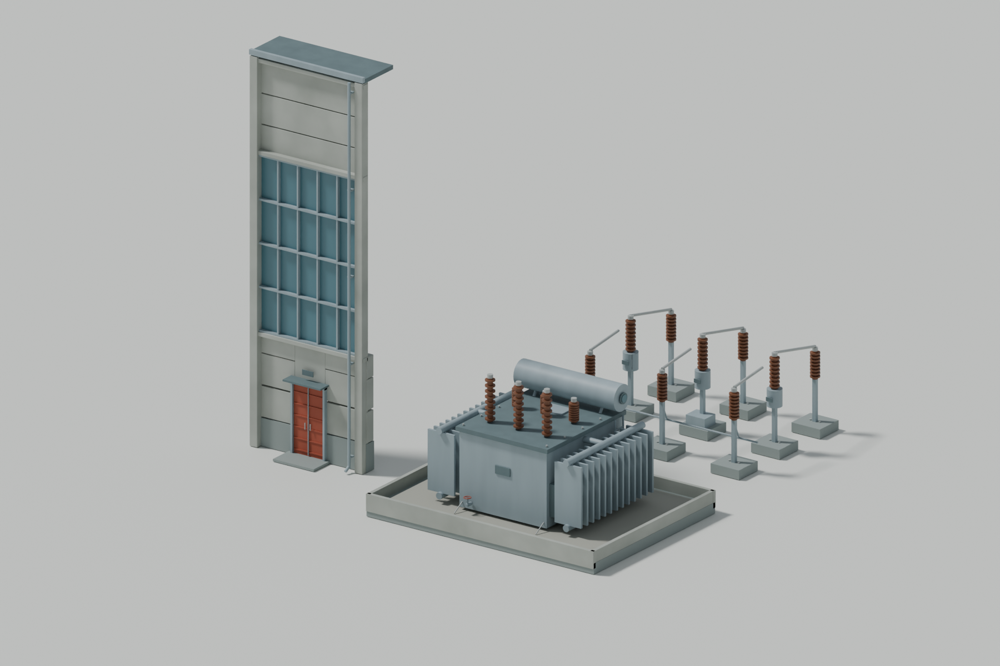

# Concept A — material/export sample A03

11 September 2026. Original Blender work and native-file preparation.
**Initial ModelViewer inspection performed; final material acceptance remains open.
No playable mod installation or gameplay test has occurred.**

Update, 12 September: the first ModelViewer inspection exposed excessive white
and black shading. [Investigation and controlled comparisons](native-shading-investigation.md)
record the result. Correcting the material-file terminator restored all three
material entries. The author's Day, Sunset and Night screenshots confirm improved
component colours; brightness and normal-map tuning still need work. The
[native review record](native-review-2026-09-12.json) pins the evidence and limits.
The author has now authorised [brightness-tuning comparison 01](../../../../shared/material-tuning-a03/README.md).
The author now prefers its combined candidate after Day, Sunset and Night review.
Brightness is retained at those settings while normal maps and final visual
acceptance remain open. The [tuning notes](../../../../shared/material-tuning-a03/README.md)
record the visible Vehicle mode and the unresolved purpose of that selector.

[Facade view](../../../../shared/material-sample-a03/review/facade.png) · [Electrical detail](../../../../shared/material-sample-a03/review/electrical.png) ·
[Distant readability study](../../../../shared/material-sample-a03/review/gameplay_distance.png) ·
[Earlier A01 component geometry under the same camera](../../../../shared/material-sample-a03/review/before_a01.png)

The comparison shows component development rather than an updated whole-plant
assembly. A02's locally reused vanilla props are unchanged and are absent from A03.
The earlier bare facade component has no service door; A01's complete plant placed
its larger doors separately in the assembly.

## Delivered

- A refined facade bay with separate concrete panels, window framing, service door,
  rain hood, drainage and a roof-edge sample.
- Original transformer and switching-group refinements.
- Editable procedural Blender sources and UV-mapped export copies.
- Original PNG texture sources, DDS files with mip chains, native material variants
  and a sample NMF.
- Independent checks of saved sources, export geometry, texture placement, surface
  directions, file references and texture compression.

All art in this sample is original Phobos project work and may accompany the public
MIT sources. [The complete asset folder and authorship record](../../../../shared/material-sample-a03/README.md)
include both editable and exported files.

The export comparison exposed unstable normals on tiny chamfered fittings, so the
chamfer now affects only large concrete edges. The tool inspection also found unsafe
sharp-edge restoration across multiple inputs; a protective wrapper exports disposable
copies. A decoded-texture comparison caught unwanted colour correction in data maps,
now explicitly disabled. These findings are recorded with the reproduction steps and
original tool credits.

## Native inspection procedure

The first baseline inspection is recorded above. Use this procedure for subsequent
comparisons: prepare and save the files first, then pause before any mouse control,
manual intervention or game exit.

The official-hosted [ModelViewer guide](https://wiki.hoodedhorse.com/Workers_Resources_Soviet_Republic/Modelviewer)
locates the tool in the game's installation and distinguishes native material files
from Blender/OBJ materials. The model has already been triangulated for inspection.

1. Open W&R's ModelViewer yourself when convenient. There is no instruction to close
   the running game for this prepared sample; pause if your setup requires it.
2. Stage the reviewed sample inside a dedicated media_soviet test folder using
   [the preparation script](../../../../scripts/prepare_material_diagnostics.py).
   Files outside that directory are rejected by ModelViewer. Use **Load NMF** for
   sample.nmf, then **Load MATERIAL** for its material.mtl baseline; these controls
   are confirmed in the author's screenshots. The corrected test folder is
   phobos_tests/electric_heating_a03_r2.
3. Check that all three objects appear, colours/textures load, the facade's pipe is
   on the same side as the Blender reference, and faces remain visible when rotated.
4. Compare the two named normal-map material variants in that same folder. Inspect
   concrete relief, thin frames, bushings and radiator shading while rotating the light
   or view. Keep the neutral baseline if neither variant is satisfactory.
5. Record the observed result and chosen material variant. Until then, leave native
   visual acceptance marked pending.

No heating configuration, electricity load/delivery test, native connections, LODs
or construction stages are claimed by this sample. Once its native appearance is
verified, the next modelling work is applying the proven approach across the plant
and preparing those remaining model assets.
