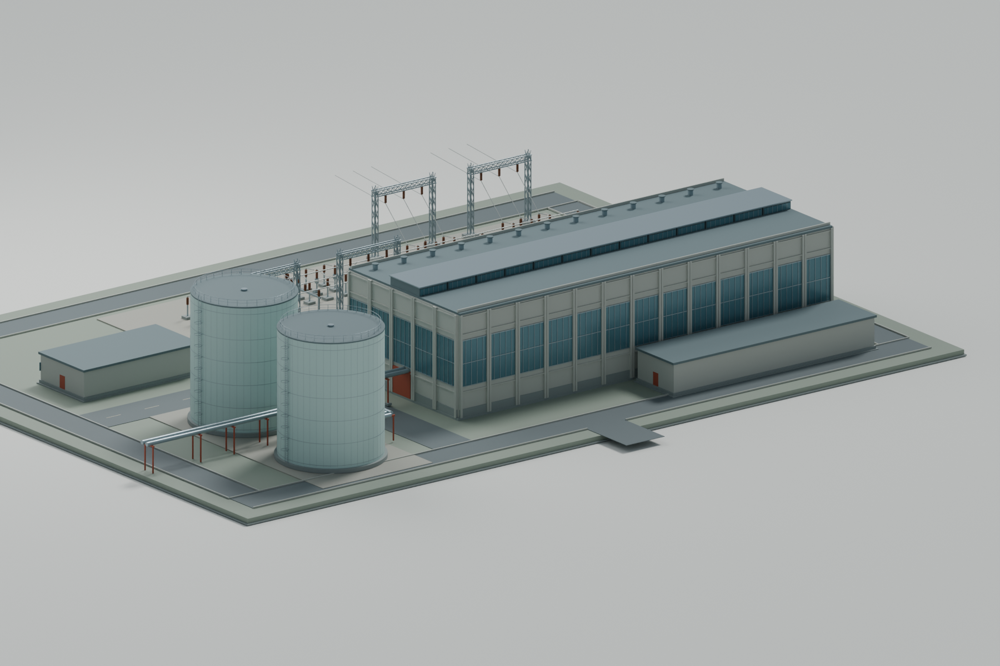
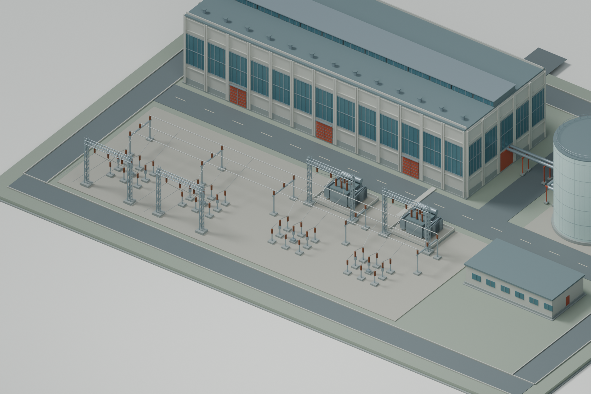

# Concept A — visual prototype A01

Original Blender geometry and review renders, 11 September 2026. **Visual prototype,
not an in-game screenshot or playable mod.** The author authorised this modelling
phase after the research and selective-reuse planning.

## Overall composition

The original 150 × 112 m site study is now a 3D assembly. A 78 × 30 m hall with
18 m wall height and a raised clerestory faces the receiving yard. Two 18 m diameter
tank bodies, 22 m tall above their bases, sit beside the hall. Roof access railings
bring their overall silhouette to approximately 24 m. Service and relay buildings,
a maintenance loop and paired heat pipes complete the principal composition.

The receiving yard includes two incoming line positions, two transformer positions,
supported three-phase busbars and four switching groups. Transformer feeder gantries
raise their indicative conductors above the busbars. These are recognisable visual
forms, not a verified protection scheme or rated electrical arrangement.

## Hall and thermal side

The hall's repeated concrete bays, blue-grey glazing, oxide-red maintenance doors
and restrained roof details establish the proposed industrial character. The tank
ladder and railing forms establish scale. Surface materials are Blender studies;
finished wear, UV maps and native game materials remain later work.

## Receiving yard

Transformers have recognisable radiator banks, bushings, conservator forms and
containment foundations. Gantries, switching groups and supported busbars are
separate reusable components. Equipment spacing and conductors remain editable.

## Reuse and credits

The major structures in these three renders use original project geometry and
procedural materials. Ordinary fences, lamps and barriers are deliberately left for
the [targeted existing-parts selection](../../source/site-props-selection.json).
Their omission from this proportions review does not reinstate an all-original
requirement. Existing parts can be incorporated under their recorded W&R terms.

Project author and design direction: **Phobos A. D'thorga / phobosgekko**.
Creation method: Codex-assisted procedural modelling from the project's original
Concept A design. Original sources and these renders use the repository MIT licence.
No donor meshes, textures, manufacturer models or third-party component payloads are
included in this review package.

## Sources and evidence

- [Editable building scene](../../source/concept-a-prototype.blend)
- [Building assembly and reproduction instructions](../../source/README.md)
- [Editable shared component library](../../../../shared/prototype-parts.blend)
- [Shared part conventions](../../../../shared/prototype-parts.md)
- [Recorded Blender verification](verification.json)

The scene was generated and rendered with Blender 5.2.1 LTS on CPU using four render
threads. The saved scene is checked by reopening it independently; see the recorded
verification for actual counts, source hashes and dependency checks. The game remained
running during this work. No installed mod, save or game definition was changed.

Next: use these views to refine proportions, then develop the architectural and
electrical detail/material sample and place suitable audited site props. Complete
the model before electricity load/delivery tests. Pause before a step requiring
the author to use the mouse, close the game or otherwise intervene.
