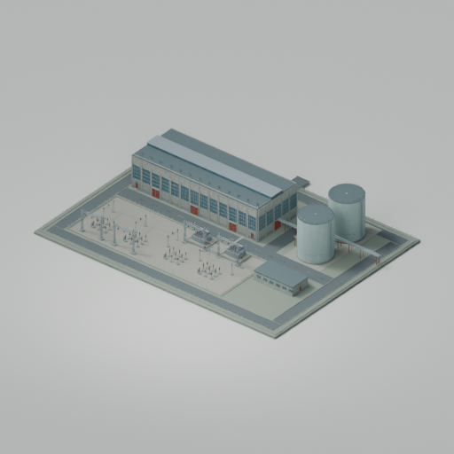

# P01 — first local gameplay prototype

12 September 2026. Copyright (c) 2026 Phobos A. D'thorga. Original project work: MIT.

**Prepared for local testing; not yet installed or game-tested.** The author has
authorised the source correction, native configuration, connections and a local
test package. Installation waits for the running game and ModelViewer to close.
Workshop publication is a later, separate action.

## What is ready

- [A05's complete Blender source](../../source/assembly-a05/README.md) includes the
  approved ground correction. The packaged model is identical to the successful 08 test.
- [building.ini](building.ini) declares a native heating plant consuming electricity.
  There is no coal/oil input, combustion particle or combustion-pollution declaration.
- [definition.json](definition.json) is the editable source for the generated game
  definitions: connection coordinates, provisional staffing and coefficients, vehicle
  access, and four construction stages covering all 24 native objects exactly once.
- [renderconfig.ini](renderconfig.ini) loads the reviewed model and original materials.
  The standard demolition effects/debris are base-game references, not bundled assets.
- [TESTING.txt](TESTING.txt) provides the manual handoff and subsequent test sequence.
  [CREDITS.txt](CREDITS.txt) accompanies the generated package with the MIT licence.

[verification.json](verification.json) pins the source/configuration/preview files
and recipes and records the successful 71-file package and ZIP checks. It records
preparation only; installation and gameplay are pending.

## Connections and provisional behaviour

| Connection | Placement and purpose |
| --- | --- |
| Two HV inputs | Front boundary of the receiving yard, matching six existing conductor endpoints. Test one feed before two. |
| One large heating link | Existing twin-header end beside the tanks, 5.2 m high at site-plan X=149, Y=82. The two visible pipes represent supply/return; they are not two native outputs. |
| Road and vehicle station | Rear entrance behind the hall; station on the rear maintenance road. |
| Pedestrian entrance | External connector 8 m beside the road connector; route enters the same open rear gateway and reaches a rear hall personnel door. |
| Water input / sewage output | Underground beside the rear entrance, 3 m deep; service-water integration is untested. |

The first configuration uses **30 workers**, native **heat coefficient 350**, and
**per-second electricity coefficient 0.5**. The worker/heat values preserve the
installed vanilla large heating plant's starting point. The electricity declaration
uses syntax present in installed electric heating and industrial definitions. These
numbers are **provisional coefficients, not promised MW/GJ ratings**. Keep final
ratings unset until the native readouts and actual delivery are measured.

The 10 m³ water/sewage storage declarations support a service-water test. No extra
industrial make-up-water coefficient is invented for the closed-loop boiler process.
Default worker water/waste behaviour, connection supply and service access still
need testing with the user's enabled systems. The two large thermal tanks have no
separately verified storage behaviour. One heat outlet may become a distribution
constraint; test it before deciding on additional outlets or header geometry.

The construction sequence is groundwork, main structures, thermal equipment, then
electrical equipment and finishing. Costs use provisional native automatic resource
coefficients. Every displayed object appears in one construction group, and explicit
construction-machine positions follow the existing maintenance roads. Actual build
costs, construction access and stage appearance remain manual tests.

## Build, verify, then pause

[gameplay_p01.py](../../../../scripts/gameplay_p01.py) regenerates the three INI files
with --generate and checks them without that option. It also checks A05 hashes,
construction-node coverage, material names, DDS payloads, preview dimensions and
the native geometry at the HV/header attachment points. Its coordinate conversion
is site-plan [X,Y,height] to native [X-75,height,56-Y].

[prepare_gameplay_p01.py](../../../../scripts/prepare_gameplay_p01.py) takes --build
with a new ignored dist/ path and --owner-id for the local owner's numeric Steam ID.
It produces a checked folder and ZIP. The committed workshopconfig.ini uses owner
0 as a template; the real owner ID is supplied only in the ignored local package.
The proposed local test ID is 900000006, not a published Workshop ID.

Use --verify on the generated numeric item folder to compare it with public sources.
Installation uses --install on that folder plus --media-root and the same --owner-id.
The installer refuses a running W&R/ModelViewer, an occupied WIP/subscription ID,
unexpected package files, changed sources or an invalid destination. It creates one
new local item, without overwriting other mods or editing saves. It never calls the
Steam Workshop API. Save and close the game only once the checked package is ready.

Menu previews are rendered from the original A05 scene by
[render_p01_preview.py](../../../../scripts/render_p01_preview.py); no game screenshot
or donor artwork is used. Existing A04 textures are copied into the built package,
making the local item self-contained even though source assets are shared in Git.

## First manual checkpoint

After Codex confirms installation, start a disposable test republic, place one plant
on level ground, and report the selected building and its connection markers. Stop
there for review before wiring a larger test network. The next guided steps check
access, one HV feed, staff and heat delivery, then power interruption and recovery.
Two-feed capacity, winter load, construction and save/reload follow. The detailed
[electricity/heat protocol](../../../../research/2026-09-11-electricity-and-heat.md)
provides the measurement framework; none of those measurements has been completed.

The prototype retains the approved original native appearance. External A02 fence
panels/lamps/barriers are absent, as in that approved native model. LODs and night
materials remain later visual work; this is not a finished release.

## Reference authors

The user specifically recommended studying robs074 and Billman007. Their installed
definitions were read for native access and construction patterns. The
[reference notes](../../../../research/2026-09-12-native-gameplay-p01.md) identify the
authors, inspected files and fingerprints. All model parts, connection coordinates
and generated definitions here belong to the original Phobos plant; no donor
definition or asset is redistributed under Phobos' licence.
