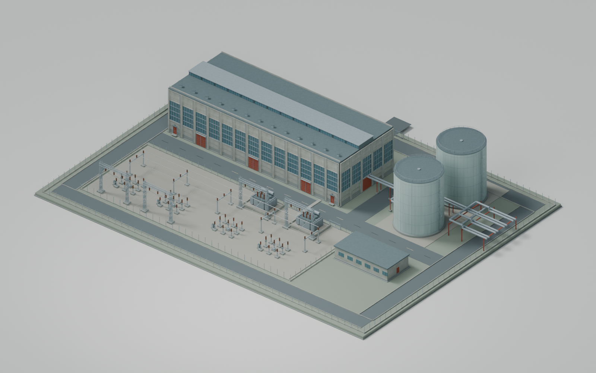

# A06 original Heating Works source for P02

Copyright (c) 2026 Phobos A. D'thorga (phobosgekko). MIT. Original art and procedural
textures created with Codex assistance. No vanilla or Workshop artwork included.

| Export | Triangles | Initial switch distance |
|---|---:|---:|
| Close / LOD0 | 109,924 | Near |
| LOD1 | 25,562 | 600 m |
| LOD2 | 10,964 | 1,200 m |

P01 had 146,208 triangles and no distance model. The close revision removes 36,284
triangles (24.8%) while preserving the hall, tank outlines, transformer shapes,
close window divisions and substantial receiving yard. Four paired heat outlets
replace the previous single pair; its original position is preserved.

All three exports have 38 construction/material nodes and 20 materials. More semantic
nodes than P01's 24 can increase submission overhead; triangle savings are not a
measured frame-rate improvement. Test actual game rendering and shadows.

## Editable and exported files

- [assembly-original.blend](assembly-original.blend): editable assembly, original
  procedural sources, semantic stage objects, all distance levels and native batches.
  A05 is retained as a hidden reference. Packed images make the source portable.
- [assembly-parts.blend](assembly-parts.blend): canonical reusable components in
  local coordinates. An identical copy is in the [shared A06 kit](../../../../shared/assembly-a06/README.md).
- [textures/](textures/): editable original diffuse, specular and GL normal PNGs.
- [native/](native/): close model, two distance models, MTL and 60 DDS maps with mips.
- [verification.json](verification.json): baseline/recipe/artifact hashes, stage and
  material membership, source-to-export mappings, dimensions and saved-file checks.

The versioned [builder](../build_assembly_a06.py) reads pinned A05/A04 inputs and
uses the new shared detail policy without editing the old recipes. Run it in
background Blender with a fresh ignored `build/` output and explicit paths to the
separately supplied exporter and texconv. Then run its `--verify-saved` mode.
Tool authors, versions and hashes are retained in the verification record; the
external tools themselves are not redistributed.

## Construction and optimisation

Main authoring objects have `construction_stage`, `part_key`, `part_id`, copyright
and licence properties. Export names include construction stage and material, plus
facade zones where needed to remain below the exporter's vertex-index limit.
The P02 definition assigns foundations, frame, walls, roof, thermal and electrical
groups independently. Groundwork references foundation nodes again intentionally.

Thin repeated bars have fewer radial sides. Tank safety hoops are continuous tubes
instead of many overlapping capped segments. Tank-body end caps concealed by the
same thermal group's plinth/lid are omitted; major silhouettes retain their shape.

Distance models omit selected fine fittings, simplify each remaining solid with a
minimum budget, and retain both broad sides of thin facade/roof plates with their
original UVs. Window divisions are omitted at the far level; close divisions remain.
Boundary posts/plinths become less dense with distance. Keep the broad roof, tank
shells and equipment masses. This policy is specific to the Heating Works geometry.

An earlier reduction by percentage damaged disconnected roofs/tanks and created
unstable thin triangles. It was rejected during source/export checks and Blender
render review. Those development attempts remain ignored local build artifacts.
The retained version uses explicit triangulation and passes the existing strict
position, UV, winding and normal checks; tolerances were not loosened.

## Acceptance boundary

Blender renders are review evidence, not in-game acceptance. The author must still
confirm partial construction, retention of completed groups, close appearance,
transitions in motion, ground/shadow behaviour, all heat outlets and save/reload.
The full [P02 test handoff](../../gameplay/p02/README.md) is the next step.

