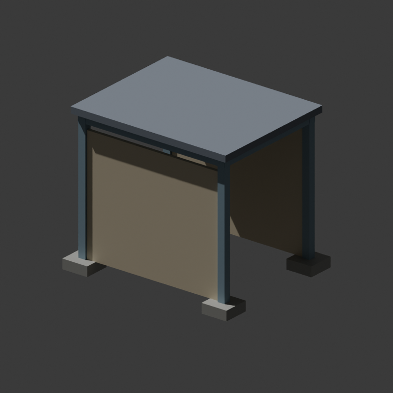

# Original P02 construction diagnostic

Copyright (c) 2026 Phobos A. D'thorga (phobosgekko). MIT. Original geometry and
plain original textures, prepared with Codex assistance. No donor art included.

[construction-probe.blend](construction-probe.blend) is the editable source for
four independent native groups: footings, structural frame, wall panels and roof.
The model has 180 triangles. [verification.json](verification.json) records tool
provenance, source hashes and a fresh saved-file comparison of every triangle,
UV, winding and normal against [probe.nmf](probe.nmf).

Its [builder](../../../../scripts/build_construction_probe.py) creates simple
geometry independently of the full plant. The local gameplay configuration is
in [P02](../../gameplay/p02/README.md). A matching source/export pair establishes
data consistency; it does not prove the game's construction display works.

The first manual acceptance step is to observe this object during construction,
deselect it, and confirm solid components appear before overall completion and
remain through subsequent phases. Stop and report if only a ghost/dirt piles appear.
