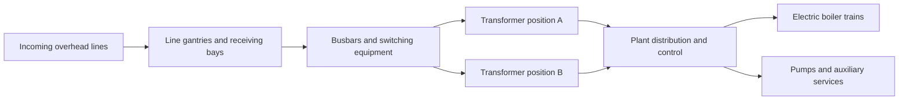

# Receiving switchyard and power research

The electrical yard must read as major infrastructure, not a few decorative cabinets.
This is a game-asset concept and research brief; voltage classes and equipment spacing
are not an approved engineering design.

## Proposed visual system

This expresses intended visual relationships. It does not assert two independent
feeds, additive native capacity, selectable breakers or simulated N-1 redundancy.

Plan incoming gantries; recognisable switching bays with circuit breakers, disconnectors,
instrument-transformer/surge-arrester forms; supported busbars; substantial transformers
with radiators/bushings; control/relay building; cable trenches or galleries; fencing,
service gates and maintenance routes. Keep the arrangement legible from ordinary
game camera distances. Choose equipment styles consistent with the agreed period.

Hitachi Energy's AIS equipment overview identifies the main equipment families.
Use it to inform original shapes and relationships, not copy its models or branding.
[AIS reference](https://www.hitachienergy.com/products-and-solutions/high-voltage-switchgear-and-breakers/air-insulated-switchgear)

PARAT documents electrode boilers compatible with 6–24 kV supply and use in district
heating. That is a process-side reference, not a W&R grid rating. Receiving a higher
grid voltage and transforming/distributing it to boiler trains is a plausible artistic
concept; the precise voltage narrative is still to be chosen.
[Boiler reference](https://parat.no/products/ieh-high-voltage-electrode-boiler)

## Questions that must precede game ratings

| Question | Required evidence |
|---|---|
| Maximum useful cable/input capacity? | Exact game build, cable type and controlled load test |
| Do multiple input nodes add capacity or merely offer alternative paths? | Test one input, then multiple inputs under the same demand |
| How do heating output and electricity declarations interact? | Tooltip and measured operation at fixed staffing/productivity |
| How does workday energy relate to instantaneous displayed power? | Recorded units and conversion verified in the current build |
| Is thermal storage functional or visual? | Documented native mechanism and power-loss test |
| Can the entire facility remain one placeable object? | Input/output and pathing feasibility at the chosen load |
| What happens at partial load or network saturation? | Heating demand, power draw and restart observations |

Candidate tests must use a disposable republic and isolated test definitions in a
later authorised implementation task. This foundation does not conduct those tests.
If native capacity is too restrictive, decide between a lower honest rating and a
modular arrangement. Do not inflate output without the corresponding electricity cost.

## Reusable electrical parts

Reserve parts for a line gantry, switching bay, busbar module, transformer and control
house. Keep transformer visual size distinct from native simulated capacity. Future
variants may share those parts without requiring a shared runtime mod.
